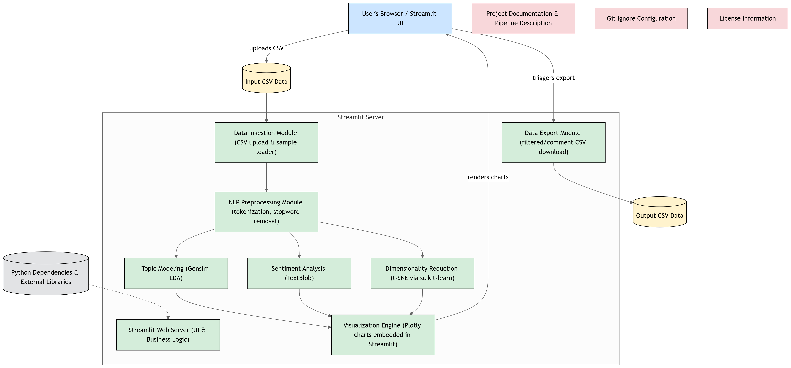

# Reviewer's Dashboard

[](https://aakinolaj.github.io/reviewers-dashboard/)

A Streamlit-based NLP dashboard for analyzing and visualizing user reviews (e.g., TripAdvisor) through **topic modeling**, **sentiment analysis**, and **interactive charts**. Built with Python, Gensim, TextBlob, and Plotly.

---

## 🚀 Features

- 📁 Upload a CSV file with a `review` column
- 🧠 Topic modeling using **Gensim LDA**
- 💬 Sentiment analysis via **TextBlob**
- 📊 Interactive visualization using **Plotly**
- 🔎 Filter and explore keywords by theme
- 📥 Download annotated results as CSV

---

## 🧱 Architecture



---

## 📊 Live Demo (Streamlit App)

[Launch Streamlit App](https://reviewers-dashboard.streamlit.app/)

---
## 🛠️ Local Setup

For a step-by-step guide on running the dashboard locally, refer to:  
📄 [Setup Guide (View Online)](https://aakinolaj.github.io/reviewers-dashboard/setup.html)

### Quickstart

```bash
# Clone the repository
git clone https://github.com/aakinolaj/reviewers-dashboard.git
cd reviewers-dashboard

# Create virtual environment
python -m venv venv
source venv/bin/activate        # On Windows: venv\Scripts\activate

# Install dependencies
pip install -r requirements.txt

# (Optional) Download corpora used by TextBlob
python -m textblob.download_corpora

# Run the app
streamlit run luxor_dashboard_app.py
```

---

## 🌍 Deployment

### Streamlit Cloud

You can deploy this app online via [Streamlit Cloud](https://streamlit.io/cloud):

- Connect your GitHub repository
- Select `luxor_dashboard_app.py` as the main app file
- Deployment will automatically install packages from `requirements.txt`

---

## ⚙️ Customization Tips

- Change number of LDA topics:
  ```python
  num_topics = 4
  ```

- Update topic labels:
  ```python
  topic_labels = {0: "Hospitality", 1: "Comfort", ...}
  ```

- Replace TextBlob with:
  - `vaderSentiment` for social media tone
  - `transformers` (e.g., BERT) for deep contextual analysis

- Add filters (e.g., by date or rating) to explore reviews more interactively

---

## 📜 License

This project is licensed under the **MIT License**.

---

## 🙌 Credits

- Developed by [@aakinolaj](https://github.com/aakinolaj)
- Built with open-source tools:
  - **Streamlit** for frontend UI
  - **Gensim** for topic modeling
  - **TextBlob** for sentiment analysis
  - **Plotly** for interactive visualizations
- Special thanks to the broader open-source community and educators in NLP and data visualization.
